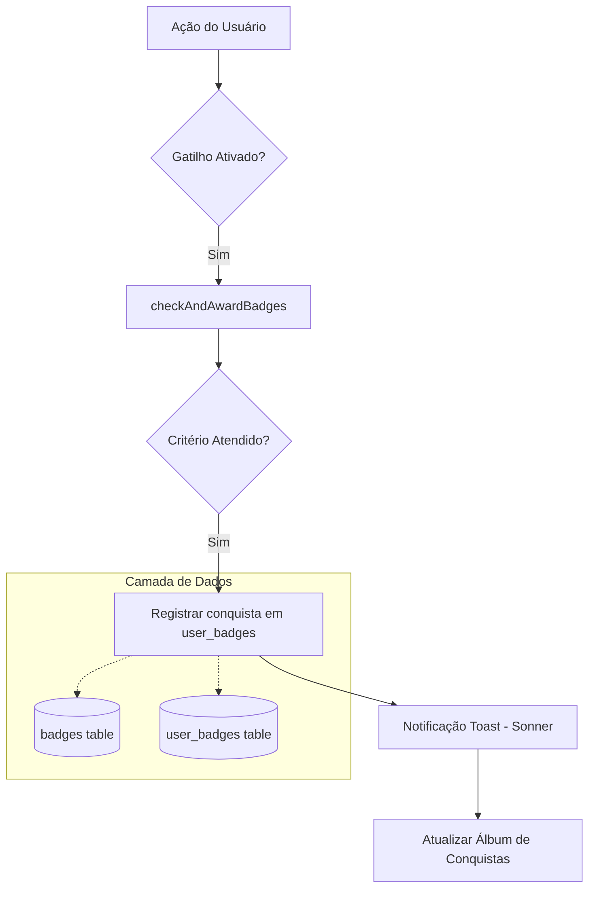

# Manual de Badges (Conquistas) - Conexão Hub

## Visão Geral

O sistema de **Badges (Conquistas)** é uma camada adicional de gamificação que recompensa os usuários por marcos específicos atingidos na plataforma. Diferente do XP, que é cumulativo e linear, os Badges são conquistas discretas que podem ser exibidas no perfil do usuário (Álbum de Conquistas), incentivando a exploração de todas as funcionalidades do sistema.

**Duração estimada para configuração**: 15 minutos
**Dificuldade**: Intermediário

---

## Arquitetura do Sistema

---

## Estrutura do Manual

| Capítulo | Arquivo | Descrição |
|----------|---------|-----------|
| 01 | [01-introducao.md](./01-introducao.md) | Conceitos, objetivos e valor do sistema. |
| 02 | [02-arquitetura-banco.md](./02-arquitetura-banco.md) | Esquema das tabelas e relacionamentos. |
| 03 | [03-gatilhos-conquistas.md](./03-gatilhos-conquistas.md) | Tipos de gatilhos e lógica de concessão. |
| 04 | [04-gestao-admin.md](./04-gestao-admin.md) | Guia do Gerenciador de Badges para Administradores. |
| 05 | [05-design-visual.md](./05-design-visual.md) | Design System: Cores, Ícones e o BadgeFormModal. |
| 06 | [06-integracao-mock-supabase.md](./06-integracao-mock-supabase.md) | Sincronização entre MockStore e Banco Real. |
| 07 | [07-notificacoes-exibicao.md](./07-notificacoes-exibicao.md) | UI: Toasts, Modais e Álbum de Conquistas. |
| 08 | [08-testes-troubleshooting.md](./08-testes-troubleshooting.md) | Como validar e resolver problemas comuns. |

---

## Pré-requisitos

| Componente | Requisito |
|------------|-----------|
| **Supabase** | Tabelas `badges` e `user_badges` criadas via migração. |
| **Admin** | Nível de acesso "super_admin" ou "admin" para gerenciar. |
| **UI** | Componente `Sonner` (toast) e `LucideIcon` configurados. |

---

## Exemplos de Conquistas

| Nome | Gatilho | Valor | Recompensa |
|------|---------|-------|------------|
| Boas-vindas | login_count | 1 | 50 XP |
| Maratonista | material_completed | 10 | 200 XP |
| Explorer | collection_completed | 3 | 500 XP |
| Pontual | streak_days | 7 | 300 XP |

---

*Documento gerado em 2026-05-09*
*Retornar para [Índice Geral](../MANUAL-DEPLOY-BRANDING.md)*
